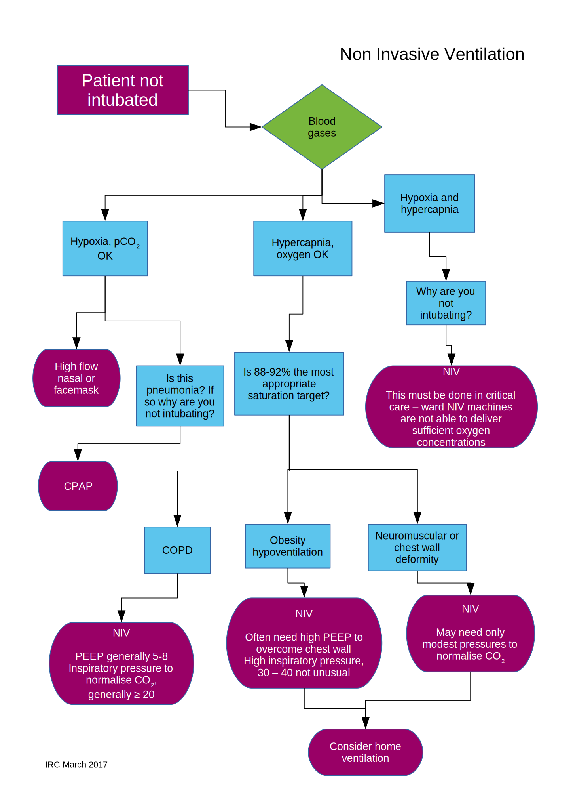

### Introduction

**Non invasive ventilation (NIV)** is a technique for supporting the respiratory system. It is indicated in type 2 (hypercapnic) respiratory failure, commonly due to exacerbations of chronic obstructive pulmonary disease (COPD) or obesity hypoventilation. Pressure is cyclically applied to the upper airway via a tightly fitting mask, thus augmenting each breath. NIV is occasionally referred to as *BiPAP* or *BIPAP*. Strictly speaking BiPAP and BIPAP are trademarks of different ventilator manufacturers and refer to specific devices or modes of ventilation. NIV is the preferred term to avoid confusion.

Continuous positive airways pressure (*CPAP*) is a superficially similar technique, predominantly indicated for type 1 (hypoxaemic) respiratory failure acutely. **This document does not cover the use of CPAP.**

This document is limited to adult patients.

NIV is used in emergency admissions for acute or acutely decompensated type 2 respiratory failure. It is also used as a domicillary treatment for some patients with chronic type 2 respiratory failure. These two situations are considered separately.

### Acute NIV

### Areas able to deliver NIV

Familiarity with NIV, including managing mask fitting, is required to deliver it successfully. For this reason, acute NIV is only to be delivered in the following areas:-

- Emergency Department
- Ward C8 (respiratory ward)
- Critical care unit

If a patient in another area requires NIV, then they should be transferred to either ward C8 or critical care (as appropriate) prior to starting NIV. To facilitate rapid access to NIV, ward C8 will keep one side room ("the NIV assessment bed") free for this purpose.

In the Emergency Department and ward C8, senior nursing staff will keep a list of staff members competent to manage patients on NIV. In the critical care unit, NIV competency will be included within the wider competencies required for managing patients receiving mechanical ventilation.

### Identification and assessment of potential acute NIV patients

#### Patients presenting to the Emergency Department

Patients in whom NIV is indicated should be started on NIV in the Emergency Department using the ED / C8 regimen. The on call medical ST3+ should assess them in the Emergency Department for suitable for ward C8 (see criteria below). The ED staff should contact ward C8 to ensure a bed is available whilst waiting for medical ST3+ review. Patients *not* suitable for ward C8 but in whom NIV is still indicated should be discussed with critical care.

#### Patients in other ward areas in Royal Blackburn Hospital

Patients currently in other ward areas who are felt to need acute NIV should be discussed with a respiratory ST3+ or consultant between 0900 and 1700 Monday to Friday and with the on call medical ST3+ at other times, prior to transfer to ward C8. The NIV assessment bed on C8 allows NIV to be provided rapidly if indicated. Acute NIV should not be started in other ward areas apart from in exceptional circumstances or with the explicit approval of a respiratory consultant.

### NIV on ward C8

#### Indications

NIV on C8 should be considered for all patients with:-

- An acute exacerbation of COPD who are **hypercapnic** (pCO2 > 6 kPa) and have a **respiratory acidosis** (pH < 7.35) despite **no more than** an hour of standard medical therapy. Standard medical therapy should consist of
    - Controlled oxygen to maintain oxygen saturations 88-92%
    - Nebulised salbutamol and ipratropium via an air driven ventilator
    - Prednisolone 30-40mg
    - Antibiotics if indicated

- Suspected obesity hypoventilation with **hypercapnia** (pCO2 > 6 kPa). If the patient is not acidotic as well as hypercapnic then NIV isn’t usually required immediately but discussion with the respiratory team is generally warranted. Nebulisers and steroids have no role in the management of obesity hypoventilation but diuretics may be indicated if there is clinical evidence of cor pulmonale.

- Patients with **hypercapnia** (pCO2 > 6 kPa) and either kyphoscoliosis or significant neuromuscular disease and no evidence of significant hypoxia. Patients with neuromuscular disease and acute respiratory infection or pneumonia may benefit from NIV but because of the likely need for oxygen should be managed in critical care, not C8, except with the **explicit prior agreement of the chest team.**

#### Contra indications

NIV on C8 is **not** to be used in patients with

- Acute pneumonia or other hypoxic illness. NIV does not prevent death or intubation in pneumonia. Either refer to critical care or consider high flow nasal cannula.
- Metabolic acidosis

Relative contra indications and cautions include (seek advice from a respiratory consultant if any apply):-

- Undrained pneumothorax (Strongly consider placing chest drain prior to NIV. If not drained equipment for chest tube insertion should be made *immediately* available.)
- Fixed upper airway obstruction
- Facial burns or trauma
- Recent facial, airway or upper gastrointestinal surgery
- Significant haemodynamic disturbance (consider whether critical care would be a more appropriate location for NIV)

Impaired conscious level and/or airway reflexes has traditionally been seen as a contra indication to NIV. In fact many patients are obtunded with hypercapnia initially and rapidly improve with NIV, so reduced level of consciousness should not stop a trial of NIV. Consideration should be given, however, to whether immediate intubation and mechanical ventilation would be more appropriate before trialling NIV.

#### Escalation planning

The need for acute NIV indicates a severely unwell patient. Every patient treated with NIV should have a documented plan as to whether it would be appropriate to offer:-

- cardiopulmonary resuscitation
- intubation and invasive mechanical ventilation

Ideally this should be documented before starting NIV, however hypercapnia often precludes proper discussion with the patient. If possible document escalation planning prior to starting NIV but **do not delay starting NIV simply to complete DNAR paperwork**. Escalation planning should be occur as soon as practicable.

#### Starting NIV in the Emergency Department or ward C8

- Start NIV in S/T mode with an initial IPAP of 10 and an EPAP of 4. These pressures are generally too low to be effective but allow the patient to become acclimatised to NIV.
- Monitor oxygen saturations (and in the Emergency Department ECG) continuously
- If necessary entrain oxygen at flow rates of 0.5 - 4 l/min to maintain oxygen saturations of 88 - 92%, *no higher*. If more than about 4 l/min oxygen is required question why the patient has substantial hypoxia and whether critical care referral is appropriate.
- If necessary give an opiate (eg morphine 5 - 10 mg orally or 2.5 - 5 mg intravenously) for dyspnoea and to improve NIV tolerance
- Over the next 20 - 30 minutes increase IPAP in steps of 2 - 4 cmH2O as tolerated, aiming for an IPAP of about 20 - 24 cmH2O.
- Repeat the blood gas and reassess the patient clinically at 30 - 60 minutes to assess effectiveness (if necessary see troubleshooting NIV). If the patient is in the Emergency Department and going to continue on NIV, arrange a suitable inpatient bed (ward C8 or critical care).
- Document NIV settings etc on the NIV chart.

#### Review on NIV

Patients on acute NIV should have vital signs recorded at least hourly until the pH has normalised. After that the frequency of observations may be relaxed if appropriate, following the Trust's policies on observations and early warning scores.

Patients on acute NIV should be reviewed at least daily by a respiratory consultant or ST3+, with consideration of

- NIV settings
- escalation status
- sympton control needs
- weaning plan

#### Weaning

The patient should be assessed on an individual basis for suitability for weaning from NIV. Generally once the patient is either showing signs of continued improvement or if the NIV is making no difference to the patient’s condition weaning (or discontinuation) from NIV should be considered.

*Principles of weaning*

Initially patients should use NIV continuously, barring short breaks for food etc. Once the patient and their blood gases are improving then build up periods of time off NIV during the daytime. Continue oxygen therapy via nasal specs or Venturi mask, monitor for any signs of work of breathing (increased respiratory rate, decreased oxygen saturation, increased use of accessory muscles). Check blood gases about two hours off NIV or if clinical deterioration. Generally patients should continue using NIV at night whilst NIV is weaned during the day unless there is an early and rapid improvement in respiratory status with NIV. The exception is patients in whom over oxygenation contributed substantially to their acute type 2 respiratory failure; such patients often only need correction of the oxygenation and a short period (hours typically) of NIV.

Discuss any patient who proves difficult or troublesome to wean from NIV with Dr Crossingham.

*Long term ventilation*

Patients with

- obesity as a major cause of the type 2 respiratory failure
- kyphoscoliosis or other chest wall or neuromuscular disorder
- COPD with persistent hypercapnia and more than one episode of acute NIV

should be discussed with Dr Crossingham about suitability for domicillary NIV.

#### Follow up after NIV

At or before hospital discharge all patients who have received acute NIV should have

- an arterial blood gas
- referral as appropriate to pulmonary rehabilitation and smoking cessation services
- consideration of future suitability for acute NIV, invasive ventilation and resuscitation

These should be documented on the discharge summary.

An episode of acute type 2 respiratory failure is a potential marker of medium term mortality. Consider whether referral to palliative care would be of benefit.

Acute type 2 respiratory failure needs an explanation. If there isn't a clear cut diagnosis consider outpatient investigation (for example, lung function tests and/or sleep studies) with follow up with the discharging consultant.

### NIV in critical care

Critical care offers NIV for patients not suitable for ward C8, particularly:-

- For post operative respiratory failure
- As part of weaning from invasive ventilation
- As an attempt to avoid intubation and mechanical ventilation
- For patients with substantial co-existing acute hypoxia
- For patients with complex ventilatory needs

### Home NIV

Domicillary NIV is of benefit to some patients with chronic type 2 respiratory failure. It may be life prolonging in respiratory failure due to chest wall or neuromuscular disease or to obesity hypoventilation. It doesn't appear to extend life in individuals with COPD but may reduce acute hospital admissions and provide useful palliation in some. NIV is used predominantly overnight at home, with patients breathing unaided or with supplemental oxygen during the daytime.

#### Indications for home NIV

*After acute NIV*

Following an emergency presentation requiring acute NIV, domicillary NIV should be considered for those

- who are unable to successfully wean from acute NIV despite the acute illness resolving
- have respiratory failure secondary to COPD and more than two episodes of acute NIV
- respiratory failure secondary to kyphoscoliosis or other chest wall deformity (offer home NIV on the first presentation, don't wait for repeated acute events)
- respiratory failure secondary to morbid obesity (discuss with a sleep physician - many of these patients have an obstructive sleep apnoea overlap and will manage with home CPAP, either from the outset or after a period of home NIV)

*From respiratory, sleep and oxygen clinics*

Outpatient domicillary NIV set up can be offered to patients attending general respiratory, sleep or oxygen clinics.

- Patients on long term oxygen therapy for chronic lung disease (predominantly but not exclusively COPD) in whom hypercapnia prevents administration of adequate oxygen flow rates and who are judged at risk of acute presentation.
- Obstructive sleep apnoea / obesity hypoventilation with daytime hypercapnia and who are either judged too hypercapnic for CPAP or fail to improve hypercapnia on CPAP.
- Patients with kyphoscoliosis or other chest wall disorders with daytime or early morning hypercapnia.

*Regional NIV services*

Patients with complex chronic ventilation requirements are covered by specialist commissioning and need to be referred to a regional ventilation centre, rather than being managed locally. Specifically those

- invasively ventilated (eg via a tracheostomy)
- requiring more than 14 hours per day NIV
- with complex co-morbidities, particularly neuromuscular diseases such as Duchenne muscular dystrophy and motor neurone diseases
- transitioning from paediatric services

need to be referred to regional services.

#### NIV set up

Patients on ward C8 suitable for home ventilation will be started on a ventilator on the ward. They will be trained to fit the mask themselves and operate the machine by ward C8 staff. Patients will be discharged once they are confident to use the machine. Early review on the respiratory assessment unit (RAU) will be offered to patients who are able to go home but need further settings adjustment.

Outpatients will be invited to attend the RAU for mask fitting and instruction on using the NIV machine. They'll then use the machine at night and be asked to return tow to three times to RAU over the next week for capillary gases and settings adjustment.

#### Follow up

Once established, patients will be followed up in chest clinic. This will initially be at about two weeks and at about three months post set up, with additional visits tailored to individual circumstances. Patients with mask fit issues will also be seen by the sleep physiologists. Home ventilation patients will be offered a minimum of 1 - 2 clinic appointments per year if stable, though obviously more frequent if required.

The medical engineering department will service ventilators annually.

#### Emergent management of home NIV patients

The RAU will act as the first port of contact for emergent problems in home ventilator patients. A telephone advice line will operate from RAU (with an answerphone outside of the RAU working hours). This will be able to offer:-

- next day in person review on RAU
- expedited clinic appointments
- referral to physiologists
- temporary replacement machines for hardware faults or issues

#### Incidental conditions in home NIV patients

Patients on home NIV admitted to hospital with acute respiratory illness should be managed on a respiratory ward. If there are specific problems with ventilation or if the patient is unable to put their own mask on and operate the ventilator themselves, then they should be admitted to ward C8 rather than one of the other respiratory wards.

Patients admitted to hospital for other (ie non respiratory) reasons can be managed on any appropriate ward **provided they are able to operate the ventilator themselves**. If they are unable to operate their ventilator normally then the may need to be admitted to C8 with joint care between respiratory medicine and the team managing the active problem. *Seek advice early from respiratory medicine*.

#### Surgery in home NIV patients

Home ventilation patients requiring surgery, anaesthesia or sedation are at higher risk than average for post procedural morbidity. Any elective procedure should be discussed in advance with Dr Crossingham. Patients should bring their ventilator in to hospital with them and be encouraged to use it as soon as possible post procedure. Patients should be managed post operatively in the Post Operative Care Unit (POCU) for all but the most trivial procedures.

Home ventilator patients requiring endoscopy should be discussed in advance with Dr Crossingham. Generally a period of post procedure NIV will be required and for some endoscopies (eg bronchoscopy) NIV *during* the procedure may be desirable.

### Appendicies

#### NIV charts

#### NIV staff competency checklist

#### Acute NIV troubleshooting guide

(to do)

#### Escalation plan for lack of acute capacity

### Abbreviations

Abbreviation | Meaning
---|---
cmH2O | Centimetres of water pressure
CPAP | Continuous positive airways pressure
DNAR | Do not attempt resuscitation
EPAP | Expiratory positive airways pressure
IPAP | Inspiratory positive airways pressure
l/min | litres per minute
NIV | Non invasive ventilation
pCO2 | Partial pressure of carbon dioxide
pO2 | Partial pressure of oxygen
RAU | Respiratory assessment unit
S/T | Spontaneous / Timed
